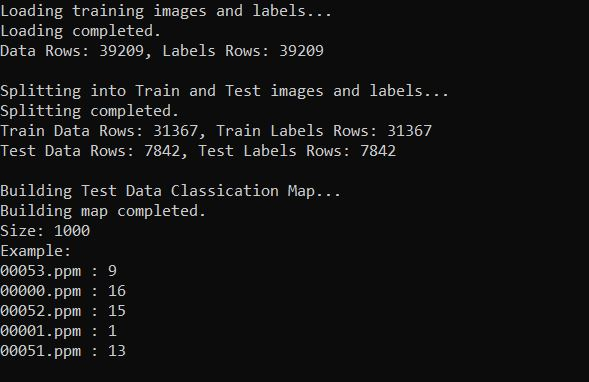
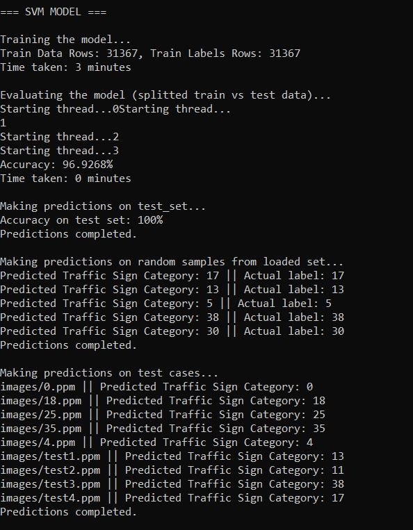
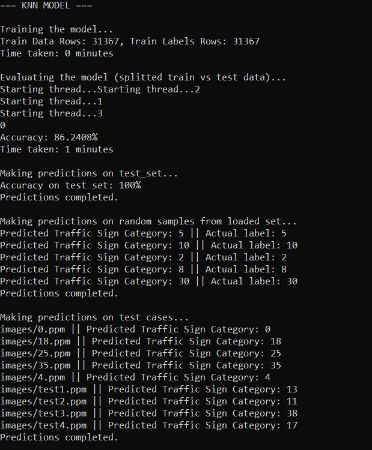

# Traffic Sign Recognition Using

This project implements a traffic sign recognition system using the k-Nearest Neighbors (k-NN) algorithm and Support Vector Machine (SVM) Algorithm, leveraging the German Traffic Sign Recognition Benchmark (GTSRB) dataset. The system is designed to classify traffic signs from images, making it suitable for applications in autonomous driving and road safety.

## Features

- **Data Loading**: Efficiently loads and preprocesses images from the GTSRB dataset.
- **Model Training**: Trains a k-NN and SVM classifier on the training dataset, with support for customizable training-test splits.
- **Prediction**: Allows users to input an image path for real-time traffic sign classification.
- **Evaluation**: Computes model accuracy using a designated test dataset.

## Demo

### 1. **Loading data**


### 2. **SVM Model**


### 3. **KNN Model**


## Requirements

- OpenCV
- C++17 or later
- CMake (for building the project)

## Usage

Run the executable:
```./traffic_sign_recognition```

## Evaluation

The model's accuracy has been evaluated using:
- splitted test set from ```gtsrb-train-data```
- test set from ```gtsrb-test-data```

The model makes predictions on:
- randomly chosen ```count``` number of images from initially loaded train data
- a test dataset inside ```/images``` folder

## License

This project is licensed under the MIT License.

## Acknowledgments

- [German Traffic Sign Recognition Benchmark (GTSRB)](http://benchmark.ini.rub.de/)
- [Integrating OpenCV with Visual Studio C++ Projects on Windows](https://christianjmills.com/posts/opencv-visual-studio-getting-started-tutorial/windows/)
